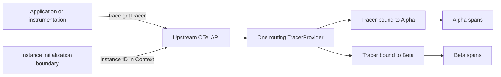

# OpenTelemetry multi-instance browser PoC

## What this is about

This PoC explores **multi-instance support for an OpenTelemetry browser distribution**.

A single browser page can contain multiple applications, libraries, or independently configured
SDK consumers. Each consumer may need its own telemetry configuration and export pipeline. However,
all consumers in the page call the same global `@opentelemetry/api`, and that API permits only one
global tracer provider per JavaScript realm.

The risk is that registering multiple SDKs either fails because the first provider wins or sends
spans from one consumer through another consumer's pipeline.

This prototype tests a possible solution: register one global routing provider, select an SDK
instance when a tracer is acquired, and permanently bind that tracer to the selected instance.

The Alpha and Beta instances in the demo represent two independent SDK consumers on the same page.
They deliberately use the same instrumentation scope and run overlapping asynchronous work. The
test passes only if their spans remain isolated and retain the correct parent-child relationships.

## Decision

Can multiple browser SDK instances serve normal consumers of the real
`@opentelemetry/api` without forking the API?

**Yes, with constraints.** A single global provider can return tracers that are permanently bound
to different SDK instances. Those tracers can operate concurrently without mixing spans.

This PoC also demonstrates that:

- Alpha and Beta use the same instrumentation scope without sharing spans.
- Parent-child relationships survive `await` when the caller passes an upstream `Context`
  explicitly.
- Two real `DocumentLoadInstrumentation` instances acquire different bound tracers and route their
  spans to the correct instance.

It does **not** demonstrate a production pipeline, automatic async context propagation, per-instance
disposal, or safe coexistence of instrumentations that patch the same browser API.

## Why this matters

If the approach works, applications and existing OpenTelemetry instrumentations can continue using
the standard API while the browser distribution manages multiple isolated SDK configurations behind
it. No forked API or proprietary tracing surface is required.

If it does not work for shared browser instrumentation, lifecycle management, or distributed
context, multi-instance support will need a different architecture or a narrower support contract.

## Architecture



`@opentelemetry/api` allows one global tracer provider per JavaScript realm. The PoC therefore
registers one routing provider and puts isolation behind it instead of trying to register one
provider per SDK instance.

## How routing works

The host creates an instance and obtains a tracer while that instance ID is present in the active
OTel context:

```ts
const bridge = installMultiInstanceBridge();
const alpha = bridge.createInstance("alpha");

const alphaTracer = bridge.runWithInstance(alpha, () =>
    trace.getTracer("shared-instrumentation", "1.0.0")
);
```

`RoutingTracerProvider` reads the instance ID only during `trace.getTracer()`. The returned
`RoutingTracer` retains the selected instance, so later span creation does not depend on mutable
global state. A tracer obtained outside an instance boundary is non-recording.

Some upstream instrumentations cache a tracer during initialization.
`initializeInstrumentation(instance, factory)` creates and enables them inside the correct boundary:

```ts
bridge.initializeInstrumentation(alpha, () =>
    new DocumentLoadInstrumentation({ enabled: false })
);
```

## Async parent context

The PoC context manager only maintains synchronous context. Browsers do not yet provide a universally
available equivalent of Node.js `AsyncLocalStorage`, so callers must retain and pass an upstream
`Context` across native `await` boundaries:

```ts
const parent = tracer.startSpan("operation");
const parentContext = trace.setSpan(context.active(), parent);

await doWork();

const child = tracer.startSpan("request", {}, parentContext);
child.end();
parent.end();
```

This is deterministic and uses the standard OTel API, but it is more explicit than
`startActiveSpan()`.

## What the browser test verifies

[`tests/poc.spec.ts`](tests/poc.spec.ts) runs two overlapping operations in a real browser and checks:

| Check | Expected result |
|---|---|
| Alpha isolation | Alpha records only Alpha application spans |
| Beta isolation | Beta records only Beta application spans |
| Async parentage | Each child keeps its instance's trace ID and parent span ID |
| Upstream instrumentation routing | Each document-load span has the correct instance attribute |
| Instrumentation parentage | `documentFetch` is a child of `documentLoad` in both instances |

The page displays `PASS` only when every check succeeds.

## Run locally

Requires Node.js 20 or newer and Microsoft Edge. CI uses Playwright Chromium.

```powershell
cd poc
npm ci
npm test
```

For an interactive view:

```powershell
npm run dev
```

Open <http://127.0.0.1:5173/>.

## Project layout

| Path | Purpose |
|---|---|
| [`src/multi-instance-provider.ts`](src/multi-instance-provider.ts) | Routing provider, bound tracer, in-memory span, and synchronous context manager |
| [`src/demo.ts`](src/demo.ts) | Alpha/Beta scenario and pass/fail checks |
| [`tests/poc.spec.ts`](tests/poc.spec.ts) | Browser-level acceptance test |
| [`index.html`](index.html) | Displays the checks and captured spans |

## Gaps before production

1. Replace in-memory span arrays with isolated processors and exporters.
2. Define per-instance flush, shutdown, and stale-tracer behavior.
3. Test shared-patch instrumentations such as `fetch` and XHR for duplicate wrapping.
4. Add W3C trace-context and baggage injection/extraction.
5. Define behavior when another SDK registers the global OTel provider first.
6. Test duplicate API packages, iframes, workers, and module federation.
