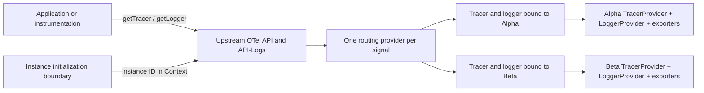

# OpenTelemetry multi-instance browser PoC

## What this is about

This PoC explores **multi-instance support for an OpenTelemetry browser distribution**.

A single browser page can contain multiple applications, libraries, or independently configured
SDK consumers. Each consumer may need its own telemetry configuration and export pipeline. However,
all consumers in the page call the same global `@opentelemetry/api` and `@opentelemetry/api-logs`,
and those APIs permit only one global provider per signal per JavaScript realm.

The risk is that registering multiple SDKs either fails because the first provider wins or sends
telemetry from one consumer through another consumer's pipeline.

This prototype tests a possible solution: register one global routing provider per signal, select an
SDK instance when a tracer or logger is acquired, and permanently bind it to the selected instance.

The Alpha and Beta instances in the demo represent two independent SDK consumers on the same page.
They deliberately use the same instrumentation scope and run overlapping asynchronous work. The
test passes only if their telemetry remains isolated and retains the correct relationships.

## Decision

Can multiple browser SDK instances serve normal consumers of the real `@opentelemetry/api` and
`@opentelemetry/api-logs` without forking either API?

**Yes, with constraints.** A single global provider per signal can return tracers and loggers that
are permanently bound to different SDK instances, each backed by a real upstream SDK pipeline with
its own processors and exporter. Those instances can operate concurrently without mixing telemetry
and can be flushed and shut down independently.

It does **not** demonstrate a production export path or automatic async context propagation. It now
does cover shared-patch instrumentations, but the answer there is a constraint rather than a
solution: a global patch needs a single designated owner, and proper arbitration is follow-up work.

## Why this matters

If the approach works, applications and existing OpenTelemetry instrumentations can continue using
the standard API while the browser distribution manages multiple isolated SDK configurations behind
it. No forked API or proprietary telemetry surface is required.

If it does not work for shared browser instrumentation, lifecycle management, or distributed
context, multi-instance support will need a different architecture or a narrower support contract.

## Signal model

The PoC follows the upstream browser model described in the
[implementation plan](../planning/IMPLEMENTATION_PLAN.md): occurrences are **events emitted through
the Logs API**, and spans are kept where correlation is genuinely useful.

| Demo telemetry | Signal | Source |
|---|---|---|
| `browser.web_vital` | Log record with top-level `eventName` | `@opentelemetry/browser-instrumentation/experimental/web-vitals` |
| `exception` | Log record, `SeverityNumber.ERROR` | `@opentelemetry/browser-instrumentation/experimental/errors` |
| `browser.navigation` | Log record with top-level `eventName` | `@opentelemetry/browser-instrumentation/experimental/navigation` |
| `browser.navigation_timing` | Log record with navigation timing attributes | `@opentelemetry/browser-instrumentation/experimental/navigation-timing` |
| `browser.resource_timing` | Log record with resource timing attributes | `@opentelemetry/browser-instrumentation/experimental/resource-timing` |
| `browser.user_action.click` | Log record with click attributes | `@opentelemetry/browser-instrumentation/experimental/user-action` |
| `browser.console` | Log record with console method and message body | `@opentelemetry/browser-instrumentation/experimental/console` |
| `GET` (fetch and XHR) | Span | `@opentelemetry/browser-instrumentation/experimental/fetch`, `/xhr` |
| `<instance>.operation` / `<instance>.http` | Span | Application code |

Document load and long tasks are not in the PoC: `@opentelemetry/browser-instrumentation@0.8.1` has
no long-task module, and it reports navigation and resource timing as log records rather than a
`documentLoad` / `documentFetch` / `resourceFetch` span tree.

## Instrumentations, and why two instances cannot all share them

Every bundled browser instrumentation now comes from
`@opentelemetry/browser-instrumentation@0.8.1` experimental subpaths. How an instrumentation acquires
data decides whether two SDK instances on one page can both run it:

| Instrumentation | Strategy | Runs in every instance? |
|---|---|---|
| `experimental/navigation-timing` | Window lifecycle listeners plus `performance.getEntriesByType()` | Yes |
| `experimental/resource-timing` | `PerformanceObserver` | Yes |
| `experimental/user-action` | One capture-phase `document` click listener | Yes |
| `experimental/web-vitals` | `PerformanceObserver` through `web-vitals` | Yes |
| `experimental/errors` | `window` error and unhandled-rejection listeners | Yes |
| `experimental/navigation` | Patches the History API | **No - one owner** |
| `experimental/console` | Patches global `console` methods | **No - one owner** |
| `experimental/fetch` | Patches `globalThis.fetch` | **No - one owner** |
| `experimental/xhr` | Patches `XMLHttpRequest.prototype` | **No - one owner** |

The browser multiplexes observers and listeners, so the first five give each instance its own
independent feed. A patch is a single shared slot, so enabling one twice wraps the first wrapper in
the second.

**This is measured, not assumed.** The PoC stands up a third instance that also enables fetch
instrumentation, issues exactly one `fetch`, and counts the result: **2 spans for 1 request**, one
in each instance. That is why the distribution assigns a single owner per shared patch, and it is
what the follow-up patch-arbitration work has to solve properly.

`user-action` is worth calling out: it attaches one capture-phase listener on `document` rather than
patching `EventTarget.prototype.addEventListener`, so it is isolated and can run in every instance.

## Upstream finding: the logger provider is resolved at enable time, not emit time

`experimental/errors` calls `this.logger.emit(...)`, using the logger handed to it by
`setLoggerProvider`, and the other bundled modules likewise use their injected tracer or logger.

This matters because the alternative breaks context routing outright. An instrumentation that calls
`logs.getLoggerProvider().getLogger(...)` **when the error event fires** gets nothing useful: a
browser event callback runs with no active OTel context, so a context-routing provider has nothing
to route on and every exception is silently dropped. The PoC needed a listener-binding workaround
for exactly that failure; it is gone, and the acceptance test passes without it.

The history still matters: it is evidence that a browser distribution needs a bridge layer and a
compatibility test suite, because one provider lookup at the wrong time can defeat context-based
routing.

## Architecture



Each instance owns real upstream SDK pipelines - a `BasicTracerProvider` and a `LoggerProvider`,
each with a batch processor and its own in-memory exporter. Nothing is shared between instances
except the single set of global OTel registrations the bridge owns.

## How routing works

The host creates an instance and obtains a tracer or logger while that instance ID is present in the
active OTel context:

```ts
const bridge = installMultiInstanceBridge();
const alpha = bridge.createInstance("alpha");

const alphaTracer = bridge.runWithInstance(alpha, () =>
    trace.getTracer("shared-instrumentation", "1.0.0")
);
const alphaLogger = bridge.runWithInstance(alpha, () =>
    logs.getLogger("shared-instrumentation", "1.0.0")
);
```

The routing providers read the instance ID only during acquisition. The returned tracer and logger
retain the selected instance, so later telemetry does not depend on mutable global state. A tracer
or logger obtained outside an instance boundary is inert.

Some upstream instrumentations cache a provider during initialization.
`initializeInstrumentation(instance, factory)` creates and enables them inside the correct boundary:

```ts
bridge.initializeInstrumentation(alpha, () =>
    new DocumentLoadInstrumentation({ enabled: false })
);
```

## Lifecycle

Each instance exposes its own `forceFlush()` and `shutdown()`:

- Batch processors buffer telemetry until an explicit flush, so `forceFlush()` is what moves data.
- `shutdown()` is idempotent, disables that instance's instrumentations, and tears down both
  pipelines.
- Tracers and loggers acquired before shutdown become inert afterwards rather than writing into a
  torn-down pipeline, and each dropped item raises a `telemetry-after-shutdown` diagnostic.
- Shutting down one instance does not affect the other.

## Global ownership

The bridge never overwrites globals another SDK already owns. If a tracer provider, logger provider,
context manager, or propagator is already registered, the bridge reports a diagnostic and exposes
`ownsGlobals === false` instead of silently taking over. The demo proves this by installing a second
bridge while the first one is live.

## Context and propagation

The PoC installs the upstream `StackContextManager` and a composite W3C Trace Context + Baggage
propagator. Browsers do not yet provide a universally available equivalent of Node.js
`AsyncLocalStorage`, so callers must retain and pass an upstream `Context` across native `await`
boundaries:

```ts
const parent = tracer.startSpan("operation");
const parentContext = trace.setSpan(context.active(), parent);

await doWork();

const child = tracer.startSpan("request", {}, parentContext);
child.end();
parent.end();
```

Outbound correlation is proven the way a real fetch instrumentation would do it: `propagation.inject`
from an explicit context into a carrier, then `propagation.extract` on the far side.

## Session and document context

Paired span and log record processors stamp `session.id` and `browser.document.url.full` onto
**both** signals, per instance. This is the upstream correlation substitute for click-to-request
parenting, which the browser cannot provide.

## What the browser test verifies

[`tests/poc.spec.ts`](tests/poc.spec.ts) runs two overlapping operations in a real browser and checks:

| Check | Expected result |
|---|---|
| `alphaIsolated` / `betaIsolated` | Each instance exports only its own application spans |
| `alphaAsyncParent` / `betaAsyncParent` | Each child keeps its instance's trace ID and parent span ID |
| `upstreamInstrumentationRouted` | Each instrumentation signal reaches the expected owning instance exporter |
| `upstreamInstrumentationParentage` | Fetch and XHR instrumentation spans keep the explicit application parent context |
| `isolatedInstrumentationsRunInEveryInstance` | All five browser-owned-source instrumentations report in both instances |
| `sharedPatchInstrumentationsHaveSingleOwner` | All four patch-based instrumentations report only in their owner |
| `sharedPatchDuplicatesWithoutArbitration` | Two instances both patching `fetch` report one request twice |
| `alphaEventsIsolated` / `betaEventsIsolated` | Each instance exports only its own log records |
| `eventsUseTopLevelEventName` | Every event carries a top-level `eventName`, not an attribute |
| `browserContextOnBothSignals` | Spans and logs carry the instance's own `session.id` and document URL |
| `w3cTraceContextRoundTrip` | `traceparent` injects and extracts with matching trace and span IDs |
| `baggageRoundTrip` | Baggage injects and extracts with matching entries |
| `forceFlushControlsExport` | Nothing exports until `forceFlush()`, then it does |
| `staleTracerAndLoggerAreInert` | Post-shutdown telemetry is dropped and diagnosed |
| `shutdownIsIdempotent` | Double shutdown is safe and the other instance keeps working |
| `globalOwnershipConflictReported` | A second bridge reports conflicts and does not overwrite globals |

The page displays `PASS` only when every check succeeds.

## Bundle size

Bundle size is the binding constraint for a browser distribution, so it is measured rather than
argued about. [`size/measure.mjs`](size/measure.mjs) runs a real production build per scenario and
writes [`SIZE_REPORT.md`](SIZE_REPORT.md):

```powershell
npm run size
```

Headline numbers, gzip, measured 2026-09-16:

| Layer | Gzip | Delta |
|---|---:|---:|
| OpenTelemetry API only (trace + logs) | 3.70 kB | - |
| + SDK (providers, batch processors, W3C propagators) | 19.56 kB | +15.86 kB |
| + multi-instance bridge (this repo) | 21.29 kB | +1.73 kB |
| Everything the PoC bundles | 41.50 kB | +20.21 kB |

Three things worth reading off that table:

1. **The SDK, not the API, is the cost.** The API is 3.70 kB. Going from API to a working SDK is
   over four times that. Anything that reduces SDK weight is the highest-leverage size work.
2. **Multi-instance support is cheap.** The whole routing bridge is 1.73 kB gzip. Isolation is not
   what makes a browser distribution large.
3. **Instrumentations are individually small but add up.** The most expensive single addition is
   `experimental/web-vitals` at +7.02 kB because it pulls in `web-vitals/attribution`; the cheapest
   new browser module is `experimental/console` at +1.33 kB. An OTLP HTTP trace exporter is
   +4.91 kB, comparable to a large instrumentation.

Per-package deltas must never be summed. Baseline plus the sum of the individual deltas is 56.79 kB,
against 41.50 kB actually measured for the combined bundle, because shared dependencies get counted
once instead of once per package. The report says this explicitly so the numbers do not get misused.

These figures are only comparable to each other. They are **not** comparable to the size shown on an
npm package page, which measures a published tarball rather than tree-shaken, minified browser bytes.

## Run locally

Requires Node.js 20 or newer and Microsoft Edge. CI uses Playwright Chromium.

```powershell
cd poc
npm ci
npm test
```

For an interactive view:

```powershell
npm run dev
```

Open <http://127.0.0.1:5173/>.

## Project layout

| Path | Purpose |
|---|---|
| [`src/multi-instance-provider.ts`](src/multi-instance-provider.ts) | Routing providers, bound tracer and logger, instance pipelines, lifecycle, diagnostics |
| [`src/browser-context.ts`](src/browser-context.ts) | Paired session and document processors for spans and log records |
| [`src/instrumentations.ts`](src/instrumentations.ts) | The bundled instrumentation set, classified by patch strategy |
| [`src/demo.ts`](src/demo.ts) | Alpha/Beta scenario, browser activity probes and pass/fail checks |
| [`tests/poc.spec.ts`](tests/poc.spec.ts) | Browser-level acceptance tests |
| [`size/measure.mjs`](size/measure.mjs) | Bundle size harness |
| [`SIZE_REPORT.md`](SIZE_REPORT.md) | Generated size report |
| [`index.html`](index.html) | Displays the checks and captured telemetry |

## Gaps before production

1. Replace in-memory exporters with OTLP export over a real transport.
2. Arbitrate shared patches properly: one patch, many subscribers, instead of one designated owner.
3. Add configurable cross-origin propagation allow lists.
4. Test duplicate API packages, iframes, workers, and module federation.
5. Add transactional instance startup with reverse-order rollback.
6. Resolve session and page view as resource entities once upstream settles it.
7. Add a size budget gate to CI so regressions fail the build rather than get discovered later.
